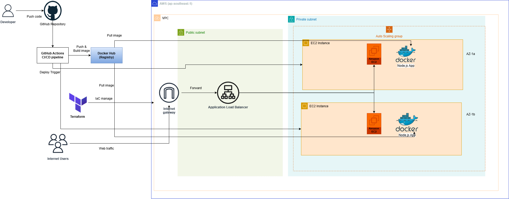
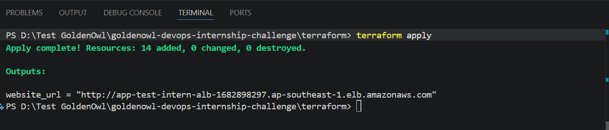
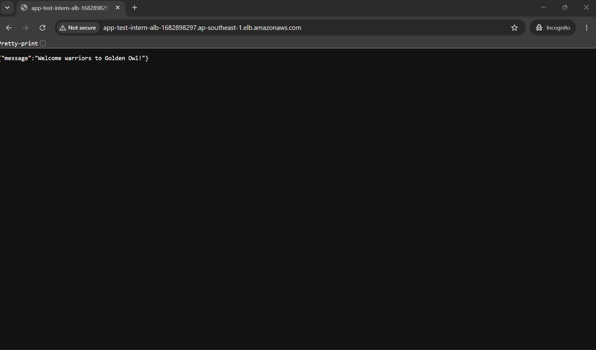
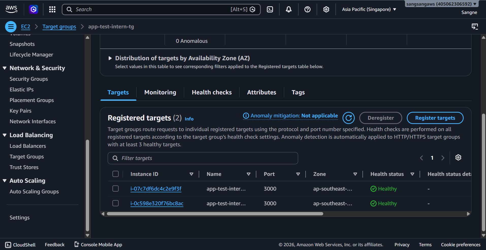
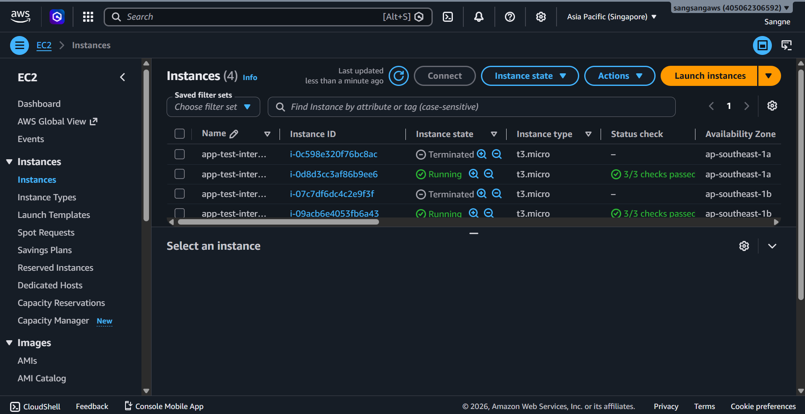

1. Kiến trúc hạ tầng
Kiến trúc hệ thống bao gồm các thành phần cốt lõi sau:
- Một VPC  với các Public Subnet được cấu hình trên nhiều Availability Zone khác nhau để đảm bảo khả năng chịu lỗi tối đa.
- Application Load Balancer đóng vai trò là cổng truy cập duy nhất cho người dùng, chịu trách nhiệm phân phối lưu lượng truy cập đến các máy chủ phía sau.
- Auto Scaling Group luôn duy trì tối thiểu 2 máy chủ EC2 chạy hệ điều hành Ubuntu. Ứng dụng Node.js được đóng gói và vận hành bên trong Docker container trên các máy chủ này.
- Máy chủ EC2 tự động thực thi kịch bản User Data khi khởi tạo để cài đặt Docker, pull Docker Image mới nhất từ Docker Hub ("tansangpn/app-test-intern:latest") và khởi chạy container.

- Sơ đồ kiến trúc tổng quan:

Để đảm bảo an toàn tối đa cho hệ thống theo nguyên tắc Least Privilege , các Security Group được cấu hình như sau:
- ALB Security Group: Chỉ cho phép nhận lưu lượng truy cập HTTP (Cổng 80) từ Internet (0.0.0.0/0).
- EC2 Security Group: Chỉ cho phép nhận lưu lượng truy cập tại Cổng 3000 đi ra từ ALB Security Group. Mọi truy cập 
trực tiếp từ Internet vào máy chủ EC2 đều bị chặn hoàn toàn.

2. Triển khai
Trước khi triển khai, cần đã cài đặt sẵn các công cụ sau:
- Terraform 
- AWS CLI 
- Git

Các bước triển khai:
Bước 1: Tải mã nguồn dự án về máy local:
git clone <ĐƯỜNG_DẪN_KHO_MÃ_NGUỒN>
Bước 2: Khởi tạo thư mục terraform để tải các provider cần thiết
cd <THƯ_MỤC_DỰ_ÁN>/terraform
terraform init
Bước 3: Kiểm tra trước khi khởi tạo hạ tầng:
terraform validate
terraform plan
Bước 4: Thực thi cấp phát tài nguyên trên AWS:
terraform apply

=> Sau khi hoàn tất thành công, Terraform sẽ trả ra output là địa chỉ DNS của Application Load Balancer. Sử dụng địa chỉ này trên trình duyệt để truy cập ứng dụng.
Lưu ý: Dọn dẹp tài nguyên sau khi triển khai và test xong bằng lệnh: terraform destroy

3. Minh chứng đã triển khai thành công:
- Kết quả chạy terraform thành công:

- Truy cập web thông qua đường dẫn DNS của Application Load Balancer thành công:

- Minh chứng Target Group báo xanh healthy cả 2 máy chủ EC2:

- Giả sử ta terminate 2 EC2 thì lập tức tạo lại 2 máy chủ EC2 mới:

